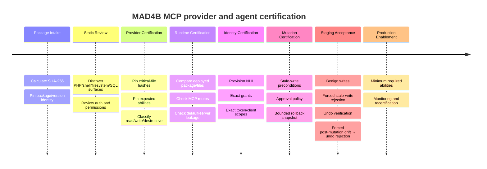
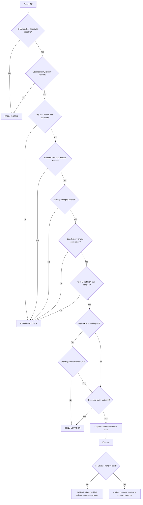

# Competitive Deep Research Reference — Attachments Only

> Provenance: this document preserves the conclusions of the prior Deep Research review requested for the MAD4B Site Control Plane. The review used **only the four attached competitor ZIPs plus the MAD4B staging kit** and intentionally used no external web/vendor/CVE sources. Treat vendor README claims as claims unless the implementation was also verified in the attached code.

## Reviewed samples and identity

| Product | Version | SHA-256 of reviewed attachment |
|---|---:|---|
| Easy MCP AI | 1.7.17 | `0cf4ab2d7d3e6de0d297ad59df68bdd60722de50e36bc8d792b9a585399be0bb` |
| AI Engine | 3.7.6 | `ff14536aca8688ddf4631a87e1d33b9fdae983feab0b7c05f2d0cb524aa44ac0` |
| Royal MCP | 1.5.0 | `ccb8528552f804849726307fe6de1e28bada0404322f79ea5bfcb41edd3b8b70` |
| miniOrange Secure MCP Server | 1.4.10 | `baf0349514e92b59a57ee88bd5b3fd7095a6a5eec4de91a217f01cd6fee0e838` |
| MAD4B staging kit used as baseline | Control Plane 0.3.0 + MCP Adapter 0.6.1 | `c49cede24ee1f36446389a73282f5ac287dcc2306803fe286003f1f95d099e08` |

The hashes above identify the exact samples reviewed. They are not vendor signatures or supply-chain attestations.

## Executive conclusion

No reviewed competitor combines all controls required for MAD4B. The strongest reusable patterns are split across products:

- **miniOrange**: strongest concrete NHI/per-agent/per-role/per-ability authorization model. Its MCP server keeps request-scoped allowed abilities, refuses MCP when no NHI is enabled, and ultimately executes through the WordPress Ability permission contract.
- **Royal MCP**: strongest user-facing reversible-mutation/undo pattern. Destructive writes capture reverse state and may return a 72-hour undo token, with capability checks during restore. The pattern is useful, but it is not universal and does not solve provider-version drift.
- **Easy MCP AI**: strong per-token tool allowlisting, capability enforcement, rate limiting and conservative tool annotations. Its token lifecycle is materially better than a shared long-lived admin secret. The URL-token fallback must not be copied.
- **AI Engine**: good OAuth/PKCE implementation and a curated core MCP surface that explicitly avoids arbitrary code execution. It is weaker for privileged autonomous control because the reviewed OAuth model exposes one broad `mcp` scope and also contains a token-in-URL fallback.
- **MAD4B**: strongest reviewed design for **pre-install certification + exact package identity + runtime provider integrity + fail-closed mutation circuit breaker**. That supply-chain/runtime-trust advantage must not be traded away for breadth.

Strategic synthesis:

> Keep the MAD4B fail-closed/certified-provider architecture; add miniOrange-style NHI, Royal-style undo semantics hardened with drift checks, Easy-style per-token subset scopes and rate/budget controls; reject URL bearer credentials and broad wildcard production authority.

The four reviewed samples did **not** provide confirmed P0 evidence of a normal authenticated MCP tool directly enabling arbitrary PHP, shell execution or generic raw source-file mutation. That reinforces the MAD4B decision to keep live PHP/source mutation out of the normal WordPress MCP control plane.

---

# Product-by-product findings

## Easy MCP AI 1.7.17

The sample requires WordPress 6.0+ and PHP 7.4+, is declared tested through WordPress 7.1, and advertises a large tool surface across WordPress Core, integrations and external data/SEO sources.

### Verified strengths

1. **Authorization layering.** Token-level allowed tools are checked before execution. The MCP server checks authentication, token tool permission, rate limit, tool existence and WordPress capability.
2. **Conservative base annotations.** The base tool defaults are more conservative than relying only on verb-name heuristics.
3. **WordPress Ability permission preservation.** Dynamically wrapped abilities are not simply exposed with wrapper authority; the reviewed registrar checks the underlying Ability permissions before execution.
4. **Credential handling.** Bearer token material is stored hashed rather than as plaintext, OAuth token generation uses strong entropy, refresh rotation uses a claim-like flow and includes reuse/revoke-chain handling.
5. **Sensitive user-meta guards.** Auth-sensitive metadata is guarded and protected keys require stronger authority.
6. **No generic PHP/shell/raw source-edit MCP primitive was found in the reviewed sample.**

### Risks / anti-patterns

**P1 — Bearer credential in URL.** The transport supports a route shaped like:

```text
/mcp/{api_key}
```

and internally converts the path credential to Authorization. Even with a random key, this broadens exposure to reverse-proxy logs, access logs, browser history and APM traces.

**P1 — Wildcard tool authorization.** The permission guard supports wildcard/pattern grants. This is convenient but unsafe as a Production default with hundreds of tools.

**P1 — No provider-runtime integrity contract.** Ability permissions may remain intact, but there is no competitor-side equivalent of exact provider package/version/critical-file identity before writes.

**P2 — Change History is not a generic undo contract.** Before/after evidence is useful but is not equivalent to an exact reversible mutation envelope with a drift-safe restore operation.

### Pattern to import into MAD4B

```text
NHI maximum grants
        ∩
OAuth/token exact scopes
        ∩
current runtime policy
        ∩
provider certification
        =
effective ability set
```

Do **not** import wildcard Production grants or URL tokens.

---

## AI Engine 3.7.6

AI Engine is broader than MCP; MCP is one subsystem inside a larger WordPress AI platform. The reviewed package requires WordPress 6.0+ and PHP 8.1+.

### Verified strengths

1. **Curated MCP rather than generic arbitrary code.** The bundled documentation explicitly separates the normal MCP surface from a different, more dangerous companion product and states the core MCP is not intended for arbitrary code execution.
2. **OAuth/PKCE fundamentals.** The reviewed OAuth path includes PKCE S256, exact redirect verification, refresh rotation and hashed secret/token storage.
3. **Explicit access-control checks.** `can_access_mcp()` defaults to a strong WordPress capability and can be filtered.
4. **No generic raw SQL or arbitrary PHP tool was found in the reviewed core attachment.**

### Risks / anti-patterns

**P1 — Broad OAuth scope.** The reviewed OAuth model exposes a single generic scope:

```text
mcp
```

The OAuth authorization is admin-only, but once authorized the client relationship is broad compared with NHI/per-client exact ability grants. The global `mcp_role` restriction applies to non-OAuth/shared-bearer flows rather than giving each OAuth client its own fine-grained capability matrix.

**P1 — URL bearer fallback.** The reviewed source also supports a token-in-path route similar to:

```text
/mcp/v1/{token}
```

This should remain forbidden in MAD4B.

**P1 — Dangerous companion separation is correct, but must remain separate.** The package warns about a companion product (“AI Engine YOLO”) with arbitrary PHP/file access. That companion was not in the reviewed attachments and was not audited; the architectural lesson is that arbitrary-code capability must remain outside normal privileged MCP.

**P2 — Annotation heuristics.** Some annotations are inferred from tool naming. High-impact confirmation semantics should be explicit/conservative, not name-derived only.

**P2 — Audit without a general rollback/tamper-evidence contract.**

### Pattern to import into MAD4B

Keep transport/authentication upstream and curated. Do **not** duplicate an OAuth server inside the Site Control Plane; consume authenticated subject context and enforce MAD4B NHI/grants above it.

---

## Royal MCP 1.5.0

Royal MCP is the strongest reviewed reference for practical mutation recovery. The sample advertises a large tool universe with WordPress Core and integrations such as WooCommerce, Elementor, Divi, ACF, Yoast and UpdraftPlus.

### Verified strengths

1. **Reverse-state/undo model.** Destructive operations may capture the prior state and return a time-limited undo token.
2. **Restore authorization.** Undo does not rely on possession of the token alone; reviewed restore paths also check capabilities.
3. **Stale/verification patterns.** Several mutation flows use expected counts, dry-run or read-after-write validation.
4. **Explicit MCP Adapter bridge namespace.** The reviewed bridge to the official WordPress MCP Adapter explicitly gathers Royal-owned abilities rather than blindly adding arbitrary third-party abilities to the same server.
5. **Layered capability mapping.** Ability-level capability and internal/object-level checks coexist.
6. **Option-write governance.** The reviewed option-update design uses multiple gates including capability, toggle, denylist and write allowlist constrained by read allowlisting.

### Risks / limits

**P1 — Provider drift in direct Elementor writes.** Multiple flows directly read/write `_elementor_data`. Dry-run, expected counts, verification and undo reduce mutation risk but do not answer whether the target Elementor package/internal contract is the exact certified version that was reviewed.

**P1 — Undo is not universal.** Large Elementor snapshots and some bulk operations have documented cases without generic undo. A product must not claim universal reversibility where a provider contract cannot capture/restore bounded state safely.

**P1 — Shared API-key authority should be treated as admin-class authority.** Capability checks help, but a shared site-level credential is not equivalent to per-agent exact grants.

**P2 — Documentation/runtime ambiguity around external Abilities.** The README suggests broad awareness of WordPress Abilities while the reviewed official Adapter bridge explicitly filters the Royal namespace. This should be resolved via runtime testing before relying on either interpretation.

### Pattern to import into MAD4B

MAD4B mutation lifecycle should be:

```text
Mutation intent
   ↓
exact authorization + approval
   ↓
capture bounded before-state
   ↓
execute provider/public API
   ↓
read-after-write verification
   ↓
record after-state hash
   ↓
return opaque undo reference
```

Undo must add a stronger invariant than the competitor reference:

```text
current state == recorded after-state
        ↓
YES → restore certified before-state
NO  → refuse automatic undo
      because newer work exists
```

---

## miniOrange Secure MCP Server 1.4.10

Among the reviewed products, miniOrange is closest to a security control plane rather than merely an MCP connector.

### Verified strengths

1. **NHI / AI identity model.** The source implements agent-like identity and ability governance rather than treating every authenticated AI client as the same principal.
2. **Fail-closed server exposure when no enabled NHI exists.** MCP tools/list and tools/call do not simply expose the full universe without an active authority profile.
3. **Request-scoped allowed abilities.** Tool execution is constrained to exposed/allowed abilities.
4. **Underlying WordPress Ability enforcement is preserved.** Execution goes through `WP_Ability::execute()`, preserving input validation, permission callback and output validation.
5. **Normalized grant evolution.** The reviewed migration shows normalized authority by NHI/role/resource/ability and avoids silently broadening prior authority across roles without review.
6. **Sensitive user/security guards.** Important because the product exposes powerful user/session/role operations.
7. **Structured operational audit.** A database audit store includes user/NHI/client/tool/status/latency/IP dimensions.

### Claims that were not treated as universally proven

The package README advertises human-in-the-loop, DLP, prompt-injection detection, anomaly detection, rate limits and multisite policy. These were not assumed to be end-to-end enforcement on every mutation path solely from README claims.

### Risks / limits

**P1 — Broad Ability universes still require careful NHI configuration.** `allowed_abilities=null` at some layer can represent unrestricted authority there; WordPress Ability permissions remain an important secondary defense but do not replace least privilege.

**P1 — User/security abilities have very high blast radius.** Password reset, session invalidation and role manipulation must remain absent from default autonomous NHI profiles.

**P1 — Provider certification gap.** Page locks/readback may make writes safer but do not establish exact target Elementor/Yoast/WooCommerce package identity and critical-file integrity.

**P2 — Audit is operational, not immutable/tamper-evident.** Retention deletion and explicit clear/truncate behavior mean it cannot be the only forensic record for a privileged control plane.

### Pattern to import into MAD4B

First-class Agent/NHI:

```text
Agent / NHI
   │
   ├── identity binding
   ├── status
   ├── allowed MCP servers
   ├── exact ability grants
   ├── provider grants
   ├── resource/object constraints
   ├── token subset scopes
   ├── mutation budget
   └── approval policy
```

No migration should create authority automatically.

---

# Comparative matrix

| Dimension | Easy 1.7.17 | AI Engine 3.7.6 | Royal 1.5.0 | miniOrange 1.4.10 | MAD4B direction |
|---|---|---|---|---|---|
| Direct RCE resistance in reviewed core | strong | very strong | strong | strong | strong; source mutation denied |
| Per-agent/client isolation | strong token tools | medium | medium | strongest NHI | exact NHI + token subset |
| Global mutation kill switch | not verified as central contract | not verified | not verified | policy/NHI controls | default OFF |
| Exact provider version certification | no | no | no | no | yes |
| Provider archive hash pin | no | no | no | no | yes |
| Runtime critical-file hashes | no | no | no | no | yes |
| Provider drift → write denial | no | no | no | no | fail-closed |
| Generic filesystem source edit | none found | none in core | none found | none found | explicitly forbidden |
| Structured DB governance | no generic raw DB | no raw DB core | no raw DB | no raw DB | bounded + transactional + sensitive deny |
| Breakglass | no | no | no | no | separate multi-gate surface |
| Plugin lifecycle | limited/not found | not in reviewed core | listing evidence | not proven | explicit opt-in + allowlist |
| Stale-write preconditions | partial | partial | good in several tools | page-lock/verification in some providers | broad SHA/fingerprints |
| Generic explicit undo | weak | weak | strongest | medium | drift-safe envelope target |
| Audit identity richness | good | good | good | excellent NHI-wise | NHI + request + mutation identity |
| Tamper-evident audit | not proven | not proven | not proven | operational/clearable | hash chain now; append-only target |
| Tool annotations | conservative | mixed/heuristic | generally good | Ability metadata | conservative |
| URL bearer secret | fallback exists | fallback exists | header/API-key model | OAuth-centric | forbidden |
| Runtime self-test | diagnostics | diagnostics/logging | health tool | health/policy visibility | explicit acceptance self-test + runtime CI |
| Supply-chain/runtime certification | weak | weak | weak | weak | strongest reviewed dimension |

Key architectural conclusion:

> Competitors are generally ahead in product UX, breadth, client authorization or undo; MAD4B is ahead in establishing trust in the exact code/runtime before permitting privileged writes. The product needs both dimensions, not one instead of the other.

---

# Threat findings by priority

## Easy MCP AI

- **P1:** token-in-URL fallback.
- **P1:** wildcard/pattern authorization is dangerous for broad Production AI credentials.
- **P1:** no exact provider/runtime integrity contract before wrapped provider mutations.
- **P2:** Change History is not a universal undo mechanism.

## AI Engine

- **P1:** broad OAuth client authority through a generic `mcp` scope compared with per-agent exact grants.
- **P1:** token-in-URL fallback.
- **P1 architectural warning:** arbitrary-code/file companion capabilities must remain outside normal Production MCP.
- **P2:** annotation heuristics.
- **P2:** audit without a general reversible/tamper-evident mutation model.

## Royal MCP

- **P1:** direct Elementor storage mutation without exact provider/runtime certification creates drift risk.
- **P1:** rollback is not universal across every operation/size.
- **P1:** shared API key should be considered admin-class authority.
- **P2:** documentation/runtime ambiguity around third-party Ability visibility.

## miniOrange

- **P1:** a broad Ability universe remains dangerous if NHI configuration becomes unrestricted.
- **P1:** user/password/session/role abilities have exceptional blast radius and must not enter default autonomous profiles.
- **P1:** provider certification/runtime integrity is missing relative to MAD4B requirements.
- **P2:** operational audit can be purged/truncated.
- **P2:** several advertised security features still require per-path runtime proof rather than README trust.

---

# Controls to transfer into MAD4B

## 1. NHI / Agent Registry

This is the largest competitive gap found in the earlier MAD4B design.

```text
SEO Agent
→ content read
→ SEO read/write
→ no users
→ no DB
→ no plugins
→ no filesystem

Commerce Agent
→ selected WooCommerce resources
→ order read
→ no site settings
→ no plugins

Recovery Agent
→ diagnostics
→ bounded repair
→ short-lived high-impact approval
```

The effective authorization contract must remain an intersection rather than a union:

```text
NHI exact grant
∩ token/client exact scope
∩ MCP server surface
∩ provider certification
∩ WordPress capability
∩ resource policy
∩ mutation policy
∩ exact approval
=
effective permission
```

## 2. Drift-safe reversible mutations

A correct SHA protects against writing over newer state, but not against a semantically wrong AI decision made on a current state. Therefore valid-but-wrong operations also require recovery.

The generic control-plane contract should expose equivalent semantics to:

```text
mutation plan
mutation execute
mutation inspect
mutation undo
```

with evidence:

```json
{
  "mutation_id": "...",
  "actor_nhi": "...",
  "provider": "...",
  "provider_certification": "...",
  "before_sha256": "...",
  "after_sha256": "...",
  "approval_ticket": "...",
  "undo_expires_at": "...",
  "request_id": "...",
  "verified": true
}
```

Automatic undo must fail when the current state no longer equals the recorded after-state.

## 3. Per-token/client subset scopes

An NHI defines the maximum authority. A given credential/session should normally carry a narrower subset. Production wildcards should be forbidden by default.

## 4. No credentials in URLs

Allowed model:

```text
approved upstream OAuth/header authentication
→ non-secret authenticated subject context
→ NHI binding
```

Rejected model:

```text
/wp-json/mcp/<secret>
```

## 5. Preserve exact-provider certification

Every provider write should continue to depend on:

```text
provider installed?
↓
exact certified package/version?
↓
critical files match?
↓
expected native API surface?
↓
provider mutation policy enabled?
↓
NHI allowed?
↓
token scope allowed?
↓
state precondition current?
↓
approval satisfied?
↓
WRITE
```

The reviewed competitors did not provide evidence for the entire chain.

## 6. Detect independent MCP write side-channels

A MAD4B DENY is meaningless if a second MCP plugin independently allows the same underlying write. Target-site policy should therefore be:

> One privileged mutation authority per site, or explicit federation where all writes pass through the same policy engine.

Competitor plugins can coexist read-only or through a governed delegation contract, but should not silently create a second independent admin write plane.

---

# Recommended certification pipeline



Pre-install/runtime decision flow:



---

# Strategic disposition of competitors

| Product | Best lesson/use | MAD4B disposition |
|---|---|---|
| Easy MCP AI | per-token tool authorization, rate limiting, integration breadth | reference/read-only or narrowly scoped coexistence; no URL token or wildcard Production grants |
| AI Engine | curated AI/content ecosystem and OAuth/PKCE reference | read-mostly reference; do not import broad OAuth scope or arbitrary-code companion model |
| Royal MCP | mutation recovery/undo UX and editorial/Elementor breadth | primary reference for reversible UX; provider writes still require MAD4B certification |
| miniOrange Secure MCP Server | NHI/RBAC/policy architecture | primary reference for identity/least-privilege layer; no independent second write authority |
| MAD4B | certified privileged control plane | principal write authority |

Priority order of ideas worth transferring:

1. miniOrange-style NHI/per-role/per-ability governance.
2. Royal-style practical undo/recovery hardened with after-state drift checks.
3. Easy-style per-token exact tool authorization plus rate/budget controls.
4. AI Engine’s architectural separation between curated normal MCP and arbitrary-code capability.

---

# Required MAD4B backlog derived from the research

## P1

- NHI/Agent Registry with normalized exact grants.
- Effective permission intersection: NHI grant × token scope × provider policy × WP capability × resource policy.
- Mutation planning / exact short-lived approval tickets for high-impact operations.
- Reversible mutation envelope and drift-safe undo.
- Production wildcard credentials forbidden by default.
- URL bearer credentials forbidden.
- Detect independent MCP write side-channels and surface them as runtime blockers.
- Provider-specific mutation certification for every writable adapter.

## P2

- Move audit evidence from bounded WordPress option storage to an append-oriented transactional table.
- Optional external/WORM audit sink.
- Per-NHI request/mutation/object/external-action budgets and rate limits.
- Effective-permission graph UI/Ability before issuing credentials.

---

# Evidence limits

- AI Engine Pro was not supplied. README references to additional Pro MCP tools do not prove their implementation.
- AI Engine YOLO was not supplied and was not code-audited; it appears here only because the reviewed AI Engine package itself warns about it.
- Competitor packages did not provide vendor-signed checksums, SBOMs, provenance attestations or CI artifacts sufficient for supply-chain verification.
- Matching provider plugin packages such as exact Elementor/WooCommerce/Yoast/ACF versions were not provided, so compatibility/provider drift could not be proved against a specific provider baseline.
- No runtime deployment configuration was supplied for competitor products: actual NHI grants, OAuth clients, enabled tools and toggles may make a real deployment stricter or looser than the source-level picture.
- Because the research scope was attachments-only, it intentionally did not use CVE databases, WordPress.org history or current vendor documentation. “Vulnerability/risk” here means evidence derivable from the reviewed files or their included changelog, not a complete public vulnerability history.

## Final research judgment

The competitive review does **not** justify replacing the MAD4B architecture. It justifies evolving it from a certified control plane into an **agent-governed reversible control plane**:

```text
                     MAD4B
                       │
        ┌──────────────┼──────────────┐
        │              │              │
   Supply-chain     Identity       Recovery
   certification      NHI          Undo envelope
        │              │              │
   Exact ZIP       Per-agent       Before state
   Critical SHA    Per-ability     After state
   Drift deny      Per-scope       Drift-safe undo
        │              │              │
        └──────────────┼──────────────┘
                       │
               Mutation Policy
                       │
         Global kill switch
         Provider gate
         Approval gate
         Optimistic lock
         Read-after-write
                       │
                  WordPress
```

The positioning target is therefore:

> **Not merely that AI can perform an operation, but that MAD4B can prove who was allowed to do it, against which exact runtime, on which state, under which approval, and how the operation can be stopped or reversed safely.**
