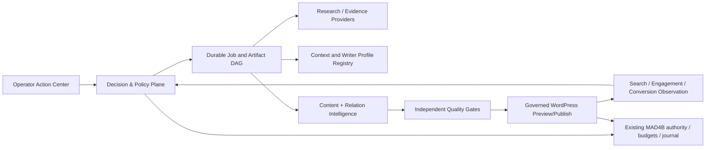

# ACI01 — Adaptive Content Intelligence OS | Spec Kit

Contract: `mad4b.aci-os.spec-kit.v1`. Parent: Feature 007. Target: PR #258 Integration Hub. State: **SPEC_BACKLOG_ONLY**. `authorizing=false`, `production_authorized=false`, `release_closure_included=false`.

## Purpose

A general, multi-site, multi-brand, multi-language, provider-neutral operating system for evidence-based content work: discover opportunities → gather corroborated evidence → plan useful experiences → draft and verify → publish through governed native WordPress capabilities → learn from comparable growth signals. Existing content, tourism products and relationship graphs are first-class citizens, not just generated articles.

This is a **complete target architecture and acceptance specification**, not a claim that its runtime exists. The root Feature 007 Spec Kit already defines Content Jobs, artifacts, providers, execution controls and publication; CE01 defines Adaptive Operations L0–L5. ACI01 refines their interaction into product journeys and explicitly names remaining gaps without rebuilding MAD4B governance.

## Reading order

1. `constitution.md` — immutable boundaries, autonomy and acceptance truth.
2. `spec.md` — functional/nonfunctional outcomes and user stories.
3. `architecture.md` — topology, five feedback loops and component ownership.
4. `data-model.md` — entities, identities, evidence and mutation boundaries.
5. `research.md` — architecture decisions, known evidence and unknowns.
6. `ui.md` — operator workspaces, Arabic/RTL and approval experiences.
7. `contracts/` — intelligence, relations, orchestration and publishing interfaces.
8. `requirements.json`, `acceptance-gates.json`, `system-map.json` — typed, machine-checkable inventory and five-loop topology.
9. `plan.md` — incremental delivery, rollback boundaries and exact gate exits.
10. `tasks.md` + `traceability.md` — implementable, independently evidenced work.
11. `acceptance.md`, `quickstart.md` — gate/negative cases and safe validation journey.

## Truth and scope

- `SOURCE_EXISTING`: parent Feature 007 / CE01 architecture or repository source; existence does **not** certify live behavior.
- `OBSERVED_READ_ONLY`: a bounded, environment/date-bound read receipt; cannot authorize writing or imply all locales are correct.
- `DESIGN_DERIVED`: new ACI01 proposal requiring later implementation and independent review.
- `EXTERNAL_PENDING`: provider, host, account or browser fact not certified.
- All task states start `OPEN`; no inherited `DONE` and no modification of frozen parent task counts.
- No dependency on a single SEO plugin, SerpApi, Firecrawl, AI model, Bit Flows, Google Drive, site URL, WordPress theme or hotel/tourism taxonomy.

## Parent contracts and integration

- `../../spec.md`, `../../plan.md`, `../../data-model.md`, `../../contracts/content-job.md`, `../../contracts/skills-orchestration.md`, `../../contracts/publishing.md`
- `../competitive-experience/adaptive-operations.md` (L0–L5, authority and runtime adaptivity)
- `../competitive-experience/contracts/acceptance.md` (external/browser/runtime evidence layers)
- PR #303 native relation inspector is an **untrusted structural evidence precursor**, not a semantic resolver or write authority.

Implementation must first map to existing classes/abilities and only introduce missing typed interfaces. Unknown ownership or capability is quarantined. New capabilities, grants, publication and Production require separate authorizing actions.

## Proposed system shape

No direct arrow from growth signals, LLM output, crawled content, or relationship observations to WordPress mutation. Each passes through independent admission, human/agent approvals when applicable, commit-time CAS and native readback.

## Canonical project definition and dynamic foundation

- [Project Charter](project-charter.md) defines the single product promise, personas, source-of-truth boundaries, first vertical slice, remaining research decisions and **DESIGN_REVIEW_REQUIRED** STOP gate.
- [Dynamic Foundation](dynamic-foundation.md) defines adaptive-by-default admission for every site, market, locale, field, content recipe, provider, account, job, review and release stage.
- The machine-owned inputs are `task-registry.json`, `requirements.json`, `acceptance-gates.json`, `system-map.json`, `dynamic-policy.json`, `content-recipes.json`, `domain-fact-authority.json` and `use-cases.json`. Their validators are `validate.py` and `dynamic_core.py`; negative fixtures live in `test_validate.py` and `test_dynamic_core.py`.
- G0–G10 are **conditional certification families**, not a fixed execution chain. Execution can proceed only as a permitted, scope-bound plan; a documentation preview cannot dispatch an operation or certify staging.
- **No implementation starts** until an exact-HEAD Spec Kit review proves registry↔Markdown bidirectional links, acyclic dynamic graphs, field/content ownership, relevant denial cases and independent site/authority boundaries. An offline/static result is never external acceptance.

## Design-closure addendum

The normative [Design Closure v3](design-closure.md) reconciles the P0/P1 objections. **Do not interpret `DESIGN_REVIEW_REQUIRED` as failure of content or permission to implement**: it is the explicit pending review/actual-test state. The Spec Kit includes independent, non-authorizing contracts for:

- `evidence-trust.json`: independent runtime attestation requirements; `certified:true` is only a claim.
- `disposition-rules.json`: six orthogonal decision/incident states with 30 independently classified synthetic test cases.
- `effect-contracts.json`: paid, WordPress, Host and irreversible effects have independent real MAD4B gates.
- `release-profiles.json`: capabilities and optional language/relations proofs do not force a ten-stage universal launch sequence.
- `ledger-contracts.json`: immutable Spec work map is separate from live execution and certification.
- `optimization-policy.json`: bounded measurement, no unverified causal conclusions and no automatic publication from feedback.

Design-only test commands are `validate.py`, `test_validate.py`, `test_dynamic_core.py`, and `test_design_closure.py`. Passing them proves repository consistency and synthetic policy behavior only; it cannot produce current WordPress, WPML, cost-provider, browser, host or Production certificates.
