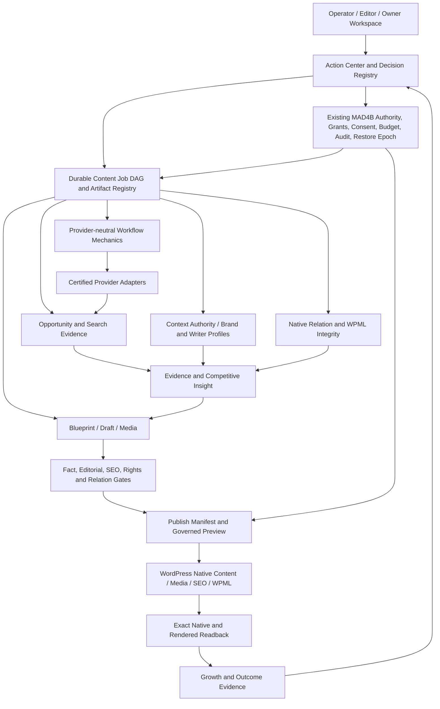

# Target Architecture and Five Decision Loops

Contract: `mad4b.aci-os.architecture.v1`; all components are **target responsibilities**, not claims of deployed functionality.

## Layered topology

Boundary: workflow engine, model, competitor page, CSV, external provider and browser are never authoritative over MAD4B mutation policy. External host actions use independent HostConnector authority.

## Five continuous decision loops

| Loop | Trigger | Inputs | Decision output | Hard stop |
|---|---|---|---|---|
| L-DISCOVERY | schedule, user inquiry or coverage gap | market, keyword, search, existing content | OpportunityHypothesis and prioritized candidates | mixed comparability, consent or paid budget missing |
| L-EVIDENCE | accepted hypothesis or facts stale | SERP, sources, provider profiles, provenance | Bounded EvidencePack and conflicts | poison, rights, stale/insufficient facts, unknown external effect |
| L-CONTENT | reviewed plan | Brand Context, WriterProfile, EvidencePack, native relations | Blueprint, content/media candidate and QA plan | invented claims, ambiguous translation or owner intent |
| L-VALIDATION | candidate edit or publish | artifact hashes, approvals, post/meta/term state, provider certification | PublishEligibility decision or Action Center ticket | invalid CAS, locale mapping, SEO/rights, native readback |
| L-OPTIMIZATION | comparable post-publication sample | GSC, analytics, index, conversion, cost | Causal/observational insight and proposed next iteration | confounded attribution, vanity ranking, budget/backpressure |

Loops produce immutable **decisions and proposals**, not hidden writes. Cycles are broken by explicit review, attempt budgets, cooldowns and immutable evidence generations.

## Primary vertical slice

1. Discover site/product taxonomy and existing pages with governed reads.
2. Register brand context and a signed, least-privilege workflow recipe.
3. Run one scoped opportunity query under zero-spend fixtures, then bounded Staging provider evidence.
4. Build EvidencePack and gap matrix; reviewer accepts one ContentBlueprint.
5. Inspect native `tour-rates -> tours-and-activities`, `related_package_term_id` and `related_properties_id`; do not remap absent verified local identities.
6. Generate one draft and run independent fact/editorial/rights/SEO/relation QA.
7. Preview only; on a separate publish gate issue a precise WordPress content operation, CAS/re-read, and render acceptance.
8. Observe a comparable growth window; propose optimization but do not apply automatically.

## Modules and reuse

| ACI responsibility | Reused Feature 007/MAD4B primitive | New addition only when proven missing |
|---|---|---|
| Job+Artifact | Content Job / Artifact Registry / Journal | domain states and typed evidence schemas |
| Context+Voice | Context Authority / WriterProfile | brand coverage and revision gates |
| Provider+Budget | certified adapter / account budget / search adapter | normalization and independent source receipts |
| Relation semantics | Content-list-meta / Post Identity / Translation Bridge / WPML | typed semantic verifier and mapper conformance |
| Workflow | provider-neutral WorkflowProvider + lease/CAS | content dependency graph/stop rules |
| Approval/Undo | NHI grants / policy / rollback / audit | review explanation and artifact-specific diff |
| Publishing | Core/RankMath/Media/translation native abilities | publish manifest, postpublish verification |
| Measurement | existing GSC/analytics evidence targets | comparison-safe learning loop |

No duplicate translation engine, no second direct privileged MCP endpoint and no opaque vendor-specific orchestrator in the core.

## Fault boundaries

- Research provider failure invalidates dependent evidence, not already verified WordPress state.
- WPML mapper unknown stops relation mutation, not unrelated writing drafts.
- Runtime or OAuth drift fences all affected side effects and exposes safe reads.
- External effect UNKNOWN enters reconciliation, not retry.
- Restore creates a new epoch; prior receipts cannot reauthorize writes.
- Growth deterioration creates a proposal, not automatic page replacement.
