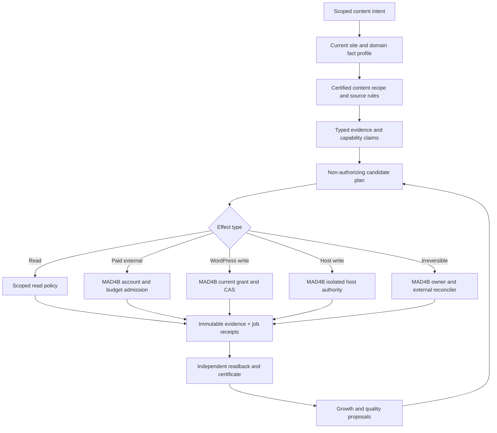

# ACI01 — Design Closure Decision and Normative Architecture (v3)

**Contract**: `mad4b.aci-os.design-decision.v3` · **Scope**: Feature 007 additive Spec Kit, code/test fixtures only · **Non-authorizing**: true.

## Product definition and system boundaries

ACI01 dynamically advises, validates and coordinates evidence-backed multilingual content lifecycle work across tenants, brands and sites. MAD4B remains the sole authority for identity, NHI/OAuth, effective grants, paid effects, privileged tool execution, release and runtime certification. WordPress, WPML, installed SEO adapters and supplier/commerce systems own original records. ACI01 owns no arbitrary WordPress write connector and no generic new control plane.

The initial vertical slice is a single disposable site/locale, one content recipe, source-labeled no-charge discovery, one bounded native read, evidence/blueprint/draft, independent QA and a review ticket; **zero real effects**. Tourism is an opt-in domain profile, never a global platform default.

## Normative contracts, ordered by trust

1. `evidence-trust.json`: distinguishes claims, fixtures, source receipts and **authority-attested runtime snapshots**. The pure Spec compiler cannot verify signatures; independent MAD4B verification must occur in the owning runtime before any live authority is possible. A matching SHA or `certified:true` from the caller is not proof.
2. `domain-fact-authority.json` + `content-recipes.json`: each product/page type chooses required facts and their owner/freshness by site/brand/locale. Every missing, cross-site, expired, unsupported or unauthorized fact is a named blocker, never implicitly waived.
3. `disposition-rules.json`: six states — `READY_FOR_NON_AUTHORITATIVE_PLAN`, `WAITING_DEPENDENCIES`, `NEEDS_EVIDENCE`, `NEEDS_REVIEW`, `QUARANTINED`, `DENIED`. Readiness and operational incident disposition remain conceptually separate; an incident can restrict a plan but not promote it.
4. `effect-contracts.json`: pure reads, paid external effects, native WordPress mutation, Host mutation and irreversible external effects each have distinct approvals, budgets, compensation and uncertainty semantics. The Spec compiler **never** executes any effect.
5. `task-registry.json` + `acceptance-gates.json`: actual artifact prerequisites are an acyclic execution DAG; review/certification predicates are a separate DAG. Runtime scope and certified content recipe determine optional native/market/provider gates.
6. `release-profiles.json`: versioned `spec_review`, `evidence_read`, `draft_assisted`, `staging_publish`, `growth_observe`, `production_promote`. First Staging publish does not require post-publication growth. Even a Spec PASS cannot authorize Production.
7. `ledger-contracts.json`: immutable Spec tasks live in Git; governed append-only execution, certification and decision receipts record changing reality separately.
8. `optimization-policy.json`: no automatic edit from SEO fluctuations; compare consistent metrics and controls, with configured budget, minimum sample, rate limit, cooling period and error budget. Unknown bounds stop automation.
9. `use-cases.json`: 30 synthetic scenarios each specify explicit owner, expected state, evidence route and negative classification; cross-site identity sharing is denied, a reviewed link between separate sites is reviewable.

## Exact action semantics

The effect decision does **not** grant permission: each operational branch is an existing MAD4B service, not Python or a newly generated workflow. External uncertain effects enter reconciliation before retry; revoke/restore/generation drift invalidates dependent future operations.

## Dynamic scope without weakening safety

- Every plan binds exact site UUID + canonical HTTPS origin + environment + actor + brand/market/locale + runtime generation + restore epoch + policy and provider versions.
- Unknown provider, origin clone, ambiguous field ownership, translated ID fallback, unknown external cost, unsigned receipt and missing signature verifier ⇒ no operational eligibility.
- Provider substitution is allowed only for equivalently certified typed behavior, account cost, rights and market data; no silent broader-capability fallback.
- A text-only article can advance without a WPML write certificate; a Tour/Taxonomy recipe cannot opt out of its native identity proofs.
- Existing-content growth observation can run without a new publish; a first staging publication does not depend on future performance evidence.
- Recovered or restored environment has a new epoch; no cached snapshot, task completion, grant or approval can cross it automatically.
- Model suggestions and static validators can propose bounded rechecks, never change grants, install arbitrary plugins, run host shell or write raw SQL.

## Evidence-backed closure levels

| Level | What it can prove | What it cannot prove |
|---|---|---|
| S0 Structural | manifests, task/requirement mapping, DAG topology, declared schema | Python behavior |
| S1 Executed Spec Tests | exact-source Python tests and adversarial fixtures | real provider/WordPress behavior |
| S2 Parent Integration | exact PR #258 base, source ownership, CI configuration | current Staging authority |
| S3 Disposable Native | true WPML/Post Meta and media adapters, readbacks/Undo | Production approval |
| S4 Live Staging/Browser | current site version, real UI/provider receipts, performance | unconditional Production readiness |
| S5 Owner Release | separately approved deployment and external effects | future growth outcomes |

Only S0/S1/S2 can close the **design package**; runtime Feature 007 tasks remain OPEN until S3/S4/S5 where applicable. `DESIGN_REVIEW_REQUIRED` must remain until executed exact-head checks and independent review are observed; source code being committed is not itself a certificate.

## Objections and acceptance

- P0 trusted identity/signed proof: documented boundary and separate receipt schema; **no live signature verifier is claimed**.
- P0 six-state behavior: distinct rules and stage disposition, unknown reason quarantined, negative cases required.
- P0 recipe facts: per-content-field requirements and exact source/expiry; no bare attribute presence sufficient for operational publication.
- P0 effects: separate guards for spend/native/host/irreversible action with compensation and quarantine.
- P1 release/governance: release profiles and separate receipts, with no fixed G9 → first G8 prerequisite.
- P1 resilience/optimization: scoped failure isolation, backpressure, cooldown and unknown-cost no-go.
- P1 extensibility: frozen 43/71/11 counts apply to this reviewed Spec Kit; dynamic interpreter admits reviewed additive revisions without arbitrary plugin/code execution.
- P1 review: real Python tests and independent parent integration evidence required before `DESIGN_CLOSED`.
