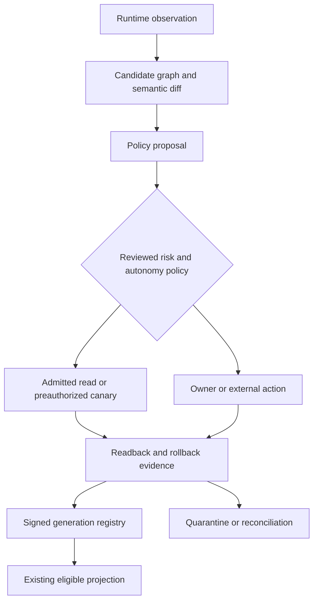

# Adaptive Capability Fabric v2 — Optional Future Operations Layer

Contract: `mad4b.adaptive-capability-fabric-v2-spec.v1`.
Source: the second user-supplied Arabic proposal, retained byte-for-byte in
`source-adaptive-operations-proposal.ar.md`. Its descriptions of current code and
90–95% automation target are proposals/historical claims, not newly measured facts.

This now contains **19 workstreams, CE041–CE059 requirements and 95 OPEN tasks
(T4001–T4095)**. CE041–CE053 come from the retained user proposal; CE054–CE059 are architecture-derived resilience gaps. The complete optional extension now has 59 requirements,
35 local phases and 175 OPEN tasks. Current frozen release closure is unchanged.

## Operating loop

Observe → Model → Diff → Classify → Simulate → Certify → Reconcile → Verify → Promote.

Every transition produces a generation-bound record. Unknown effect, untrusted
provenance, missing authority, stale generation or incomplete restoration exits to
quarantine/reconciliation/review. Promote means eligibility inside an existing
reviewed exposure; it never creates a permission, grant or tool mount.

## Autonomy levels

| Level | Permitted automatic work | Mandatory boundary |
| --- | --- | --- |
| L0 Observe | Registered masked runtime metadata | No unknown code/endpoint invocation |
| L1 Adapt | Non-authorizing compatible projections/index/schema views | No execution-binding or authority change |
| L2 Repair | Proven managed non-authorizing drift | Field ownership, three-way diff, CAS and admitted plan |
| L3 Certify | Verified zero-effect shadow reads or preauthorized disposable reversible canaries | Existing exact Staging authority, cost bounds, approved recipe, real readback/rollback |
| L4 Activate | Refresh eligibility within an existing reviewed Staging projection | Exact artifact/contract/behavior receipts and existing eligible grants; no new mount |
| L5 Governed | No automatic action | New authority, high-risk, Production and Breakglass remain owner-governed |

Automatic operation is an explicit opt-in policy, not a consequence of an autonomy
label. A classifier confidence such as 0.94 or a GET/read annotation cannot prove
zero side effects or low sensitivity. A new writer remains a proposal until its
actual authority/risk/behavior conditions are satisfied.

## Workstream outcomes

| Family | Workstream | Result required |
| --- | --- | --- |
| ACFGRAPH | Runtime Candidate Graph v2 | Exact immutable discovery/diff with unknown providers and affected-dependency isolation |
| ACFCLASS | Semantic Classifier | Versioned policy proposal with uncertainty and no authority creation |
| ACFMAN | Declarative manifests | Typed reviewed executor strategies; no generated PHP or arbitrary symbol calls |
| ACFSYNTH | Dynamic operations/workflows | Generic schema-driven primitives, pinned safe dependency plan and approved execution |
| ACFSHADOW | Read shadow certification | Sampled semantic/privacy/cost parity; candidate output excluded from active response |
| ACFCANARY | Reversible canary engine | Isolated target, exact pre-state/write/readback/rollback/restoration and signed receipt |
| ACFPACK | Certification packs/registry | Independently versioned signed immutable data, compatible interpreter and anti-replay |
| ACFOWN | Three-way reconciliation | Preserve human changes; repair only proved owned fields; review ambiguous conflicts |
| ACFJOURNAL | Universal journal | One human-facing projection over existing operation/audit/Undo evidence |
| ACFUPDATE | Update acceptance | Exact pre/post graph/authority/topology/workload receipt and safe scoped recovery |
| ACFHOST | Host capability registry | Measured environment eligibility with precise external remediation |
| ACFEXT | External provider framework | Shared credential/account/scope/cost/rights/health contracts behind admitted adapters |
| ACFACT | Operator Action Center | Verified repair, approval, external action and reconciliation states with truthful metrics |
| ACFROLL | Release rings/fleet promotion | Exact cohort/site rollout with site-local authority and fencing |
| ACFSLO | Automation SLO/error budgets | Backpressure, retry budgets and independent kill switch |
| ACFSUPPLY | Supply-chain trust | Provenance without signature-as-authority |
| ACFMIGRATE | Registry schema migration | Reversible mixed-generation policy/registry evolution |
| ACFFUZZ | Adversarial compatibility fuzzing | Disposable deterministic schema/fault/concurrency challenges |
| ACFDR | Restore/DR convergence | Restore epoch and current-truth authority rebinding |

## Reduce code changes safely

The runtime graph supplies observed facts; policy overlays classify and restrict
them. A declarative manifest can select an existing reviewed typed strategy.
An unfamiliar provider protocol, new side-effect semantics or missing serialization
strategy still needs code review. The registry cannot turn a discovered function
name, HTTP route, SQL table or arbitrary URL into an executable binding.

Separate engine/PHP releases, policy revisions, certification evidence and
Skill/content profile revisions. Data packs are signed, immutable, versioned,
auditable, compatible, expiring/revocable and atomically replaceable. Signatures
prove source identity, not that an authority-increasing change is approved.

## Ownership and repair

Compare Last Managed State, Current Runtime State and Desired Policy State per
resource/field. Proven managed drift may produce a bounded admitted repair;
human-owned valid edits are preserved/rebased; provider drift recertifies; unknown
or locked changes enter review. Human-added language `fr` can be retained only
when the language field is explicitly unlocked and valid. This does not resume a
Search Profile, unfreeze spending or overwrite Brand/authority policy.

Update recovery separates safe reconciliation from an exact preauthorized release
rollback. Possible external side effects enter reconciliation before retry.
Authority/topology change or a new side channel blocks affected execution rather
than being hidden by automatic acceptance.

## Automation measurement

The 90–95% maintenance target is aspirational. Establish a workload baseline first.
Report verified automated completions / all eligible observed maintenance plans,
alongside interventions, failure/quarantine counts, MTTR, rollback failures,
external-action counts and cost. Failed eligible plans remain in the denominator;
duplicates and out-of-scope plans have explicit exclusion reasons. Governance
decisions are never counted as maintenance success. No observed percentage or
SELF-CONVERGING claim is emitted by this Spec-only extension.

## Resilience expansion

The additional workstreams address failure modes of a long-lived autonomous control plane: fleet rollout, repair-loop backpressure, supply-chain drift, schema evolution, adversarial provider changes and restore/time-travel. None changes L0–L5 authority semantics.
