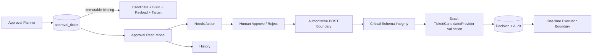

# MAD4B Approval Console v2

## Purpose

Approval Console v2 separates the human decision **read model** from the authoritative approval/mutation **write model**.

The GET page is intentionally cheap and read-only. It does not reconcile write authority, prime MCP, create tickets, consume tickets, or mutate state. The POST decision boundary remains strict and revalidates the authoritative ticket, exact candidate/build, payload, provider, agent, environment and physical governance schema before persisting an approval decision.

## Architecture

## Schema v5

Candidate binding is stored with the ticket rather than in a bounded option cache:

- `candidate_binding_contract`
- `candidate_sha`
- `build_fingerprint`
- `binding_environment`
- `binding_host`
- `bound_at`

Inbox indexes:

- `decision_inbox (status, expires_at, id)`
- `candidate_inbox (candidate_sha, build_fingerprint, status, expires_at)`

Legacy option bindings are migrated during the v5 schema upgrade and retained only for rollback compatibility. New exact candidate bindings are persisted in the ticket row.

## Effective status

The read model never mutates lifecycle state merely because a page was opened. It derives an effective status:

- stored `pending` + expired timestamp => `expired`
- stored `pending` + non-current candidate/build => `stale`
- otherwise the stored lifecycle status is shown

Only fresh `pending` + exact current candidate/build + `mutation` + `mad4b-write` rows appear in **Needs action**.

## Schema guard

Normal GET/read paths use an integrity token written only after a successful deep schema migration/verification. This removes repeated `SHOW TABLES` probes from hot paths.

Critical approval and mutation boundaries call the memoized physical guard. The deep guard verifies all governance tables and the v5 approval binding columns once per request and fails closed if physical integrity is unavailable.

## Performance invariants

The Approval Decisions GET surface must keep these invariants:

1. no per-row `candidate_binding()` lookup;
2. no write-authority reconciliation on GET;
3. no MCP runtime priming on GET;
4. no physical schema probing through `is_ready()`;
5. one bounded inbox query or one bounded history query;
6. history is paginated and lazy;
7. every POST still executes full authoritative revalidation.

These invariants are guarded by `tests/approval-console-v2-contract.py` and the dedicated GitHub Actions workflow.
