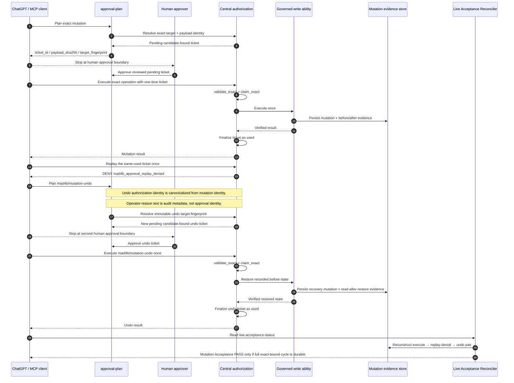

# MAD4B Mutation Acceptance Sequence

This document is the canonical operator/developer sequence for the governed Staging Mutation Acceptance cycle.

Scope: `staging.egypttourgates.com` only. Production and Breakglass remain fail-closed.

## Sequence map



## Canonical undo authorization identity

`mad4b/mutation-undo` is special because its human `reason` text may legitimately differ between planning and execution. That text must not change the approval target or canonical approval payload.

The authorization-facing input is normalized to:

```text
{
  mutation_id: <exact mutation id>,
  reason: "governed_mutation_undo"
}
```

The actual operator-provided reason is preserved request-locally and restored only for the mutation callback/audit intent.

The undo target fingerprint is bound to immutable mutation evidence:

```text
contract = mad4b.undo-authorization-target.v1
ability = mad4b/mutation-undo
provider = core
mutation_id
original_ability
original_provider
target_type
target_id
after_sha256
rollback_payload_sha256
```

This means changing the operator wording does not break a valid reviewed undo plan, while changing the referenced mutation or immutable after/rollback evidence changes the target fingerprint and fails closed.

## Human boundaries

The flow has two independent human approval boundaries:

1. The forward mutation ticket.
2. The undo ticket.

Approval of the first does not authorize replay, undo planning, undo approval, or undo execution.

## Required durable evidence

The acceptance cycle is complete only when the reconciler can prove all of the following for the same exact candidate/build:

- execution ticket exists and is candidate-bound exactly;
- forward mutation event exists;
- the one-time ticket replay was denied;
- undo ticket exists and is candidate-bound exactly;
- recovery mutation exists and points to the original mutation;
- restored state equals the recorded before-state;
- audit chain is valid;
- mutation/recovery pair is valid.

## Fail-closed rules

Never bypass or hand-supply a target fingerprint to work around a mismatch.

If the candidate SHA or build fingerprint changes, create a new approval plan. Old candidate-bound tickets are stale by design.

If current target state no longer matches the recorded after-state, automatic undo must refuse to overwrite newer work.

Production auto-enable, Breakglass auto-enable, raw SQL exposure, and wildcard grants are outside this acceptance path and must remain disabled/absent.
